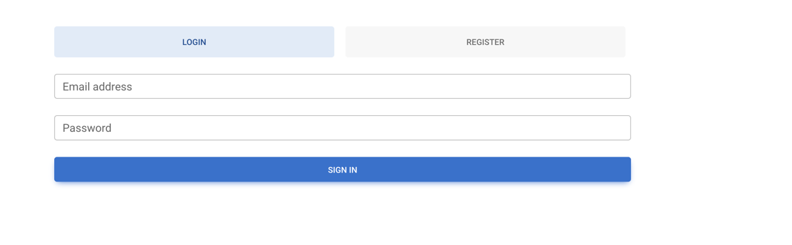

## Chat Application
React Chat application is a user-friendly and interactive platform that allows users to engage in real-time conversations. The application features a unique command bot that provides stock market information upon receiving specific commands. One such command, for example, is `/stock=aapl.us`, which triggers the stock-bot to fetch and display the latest stock information for the AAPL (Apple Inc.) stock traded on the US market.

# Bot Service
Bot Service is an independent application designed to facilitate the retrieval of stock prices using stock codes. It integrates with RabbitMQ to receive messages containing stock codes and makes HTTP requests to stooq.com to fetch real-time stock price data.

# Chat Service
Chat Service is a messaging application that enables users to send messages in chat rooms. It leverages technologies like Golang, PostgreSQL, JWT authentication, and ORM with gorm.

## Key Features
- Real-time Messaging: Users can exchange messages in real time, creating a seamless and dynamic conversation experience.
- Command Bot: The application incorporates a command bot that responds to specific commands entered by users. For instance, typing /stock=aapl.us triggers the bot to fetch and display current stock information for Apple Inc. without the need for database storage.
- Responsive Design: The chat application is designed to be responsive and accessible on various devices, ensuring a consistent user experience across desktop and mobile platforms.
- Interactive User Interface: The user interface is intuitive and user-friendly, allowing users to send messages, receive responses from the command bot, and engage in meaningful conversations effortlessly.

## Technologies
- React
- Golang
- RabbitMQ
- testify

## Requirement
- Docker
- docker-compose
- Golang `>=` 1.20
- golangci-lint

## Setup
You need to clone the repository <br />
<b>Repo : git@github.com:brcodingdev/chat-app.git </b>

## Run

```bash
# run the service
$ make run
```

## Front-end
After run the application

Open your browser:
http://localhost:3000/

You will see the this page <br />


### Test

```bash
# run tests
$ make test
```

## TODO
- More Unit Tests